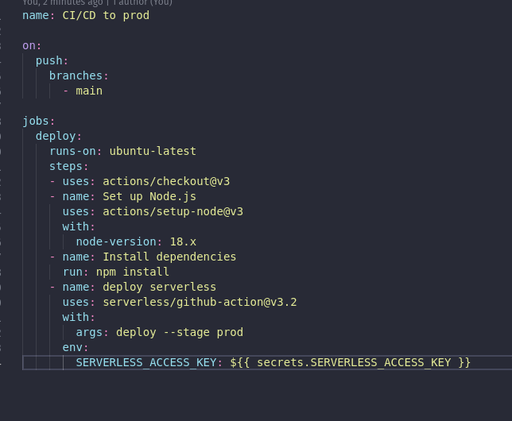

## To-Do API


This is a serverless API for a To-do list, where you can create, read, update, delete, and retrieve all the to-do notes.

## Stacks

- AWS API Integration
- AWS DynamoDB
- AWS Lambda
- AWS SDK
- Github Actions (for CI/CD)
- NodeJS
- Serverless Framework v3


## Structure


```
└── service/
    └── aws/
        └── dynamoDb.js
└── src/
    └── handlers/
        ├── createNote/
        │   ├── index.js
        │   └── data.json
        ├── deleteNote/
        │   ├── index.js
        │   └── data.json
        ├── readAllNotes/
        │   ├── index.js
        │   └── data.json
        ├── readNote/
        │   ├── index.js
        │   └── data.json
        └── updateNote/
            ├── index.js
            └── data.json
```

## Running Locally

1. Install dependencies with `npm install`.
2. Deploy with `sls deploy --stage <stage-name>`.
3. Test locally with `serverless invoke local --function <function-name> -p <path-to-data-file>`.

## API Reference

| Description   | Method | URL         | Payload     | Response     |
|---------------|--------|-------------|-------------|--------------|
| Read a note | GET    | /toDo/{id} | -           | `{ "content": String, "id": UUID, "title": String }` |
| Read all notes | GET    | /toDo/all      | -           | `[ { "content": String, "id": UUID, "title": String } ]` |
| Create a note | POST   | /toDo      | `{ "content": String, "title": String }` | `{ "message": "Note created" }` |
| Update a note | PUT    | /toDo/{id} | `{ "content": String, "title": String }` | `{ "message": "Note updated" }` |
| Delete a note | DELETE | /toDo/{id} | -           | `{ "message": "Note deleted" }` |

## CI/CD



## Loom Video

https://www.loom.com/share/bebaa54a9da340eab7cdd9dff078c1a9?sid=0df8259c-e5f7-400b-83cb-cb9f7ef6e9c1

## Profile

Linkedin: https://www.linkedin.com/in/debora-aspesi-martinez-8aa7361b9/
Email: deboraaspesimartinez@gmail.com
Phone: +55 51 999831959